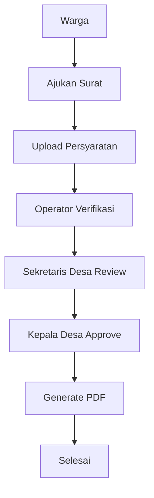
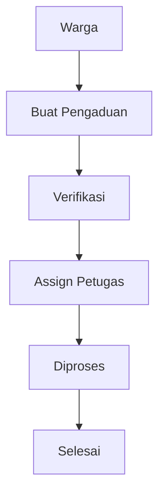
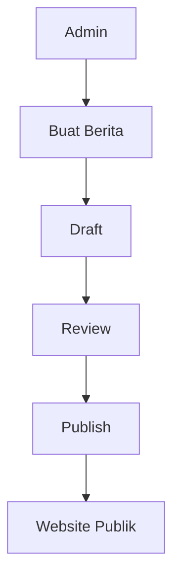
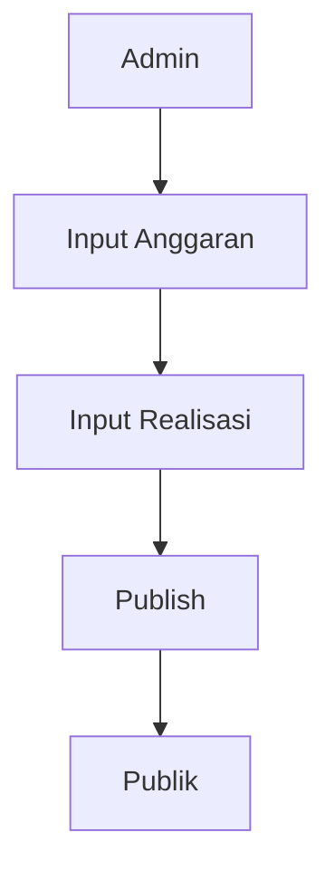

# Business Process

## Tujuan
Dokumen ini menjelaskan proses bisnis inti SatuDesa untuk modul layanan publik dan operasional desa.

## Proses Surat Menyurat
### Narasi
Warga memilih jenis surat, melengkapi form, mengunggah persyaratan, lalu sistem meneruskan pengajuan ke operator untuk verifikasi administratif. Setelah lolos, surat direview Sekretaris Desa dan disetujui Kepala Desa sebelum PDF dihasilkan dan diarsipkan.

### Alur

### Aturan Bisnis
- Setiap pengajuan harus terkait satu `letter_type`.
- Persyaratan wajib berbeda untuk tiap jenis surat.
- Operator dapat mengembalikan pengajuan ke warga jika dokumen kurang.
- Approval final hanya dapat dilakukan Kepala Desa atau role setara.
- Dokumen final disimpan sebagai arsip dan dapat diunduh warga.

## Proses Pengaduan
### Narasi
Warga membuat pengaduan, admin atau operator memverifikasi kelengkapan dan kategori, lalu pengaduan ditugaskan ke petugas untuk diproses sampai selesai.

### Alur

### Aturan Bisnis
- Pengaduan dapat memiliki kategori, prioritas, lokasi, dan lampiran.
- Status minimal: `submitted`, `verified`, `assigned`, `in_progress`, `resolved`, `rejected`.
- Semua perubahan status harus menyimpan histori komentar internal atau publik.

## Proses Berita

## Proses APBDes

## SLA Awal yang Disarankan
| Proses | Target SLA |
| --- | --- |
| Verifikasi surat | 1 hari kerja |
| Review surat | 1 hari kerja |
| Approval surat | 1 hari kerja |
| Verifikasi pengaduan | 1 hari kerja |
| Penugasan pengaduan | 1 hari kerja |

## Titik Kontrol
- Validasi form dan dokumen saat input.
- Log aktivitas untuk verifikasi, review, approval, publish, dan assign.
- Notifikasi status ke warga dan petugas.
