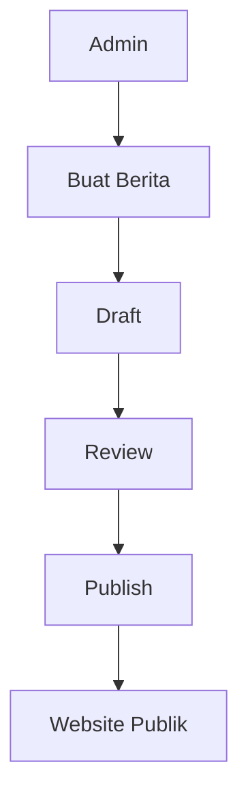
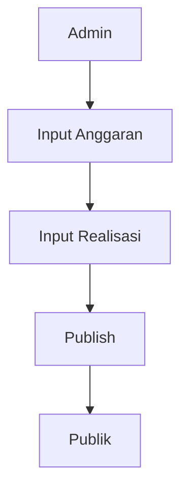
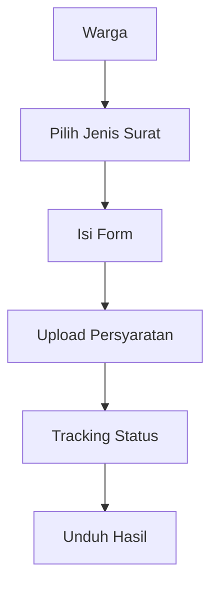
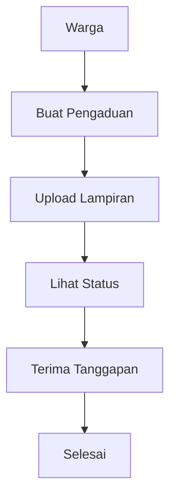
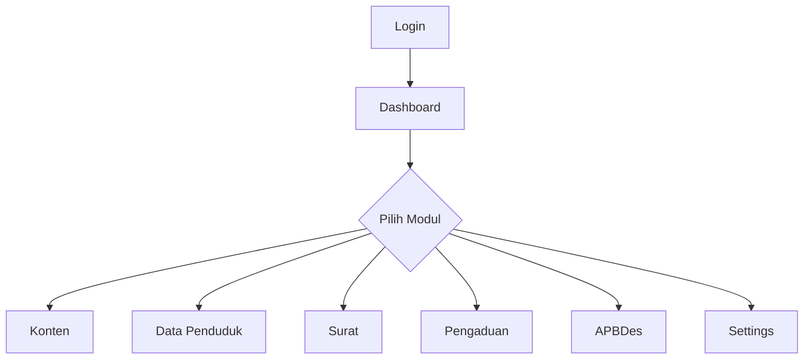

# User Flow

## Tujuan
Dokumen ini merangkum alur interaksi pengguna untuk modul prioritas.

## Flow Berita

### Catatan
- Draft dapat diedit berulang.
- Tahap review dapat dilakukan Admin Desa atau editor yang diberi izin.
- Publish memicu update listing dan detail berita di website publik.

## Flow APBDes

### Catatan
- Anggaran diinput per tahun dan kategori.
- Realisasi dapat diperbarui berkala sebelum publish final.
- Data publik menampilkan ringkasan dan detail sesuai kebijakan transparansi.

## Flow Surat Menyurat

## Flow Pengaduan

## Flow Admin Dashboard

