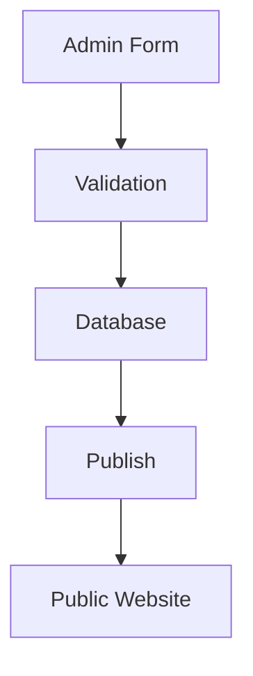
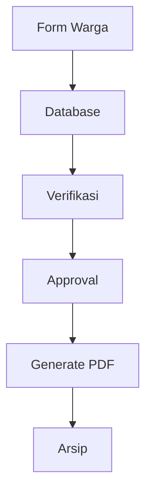
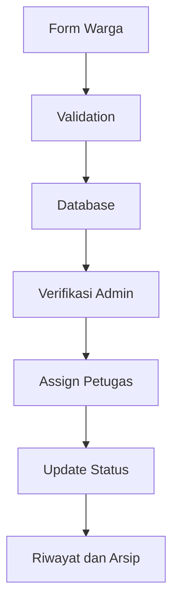
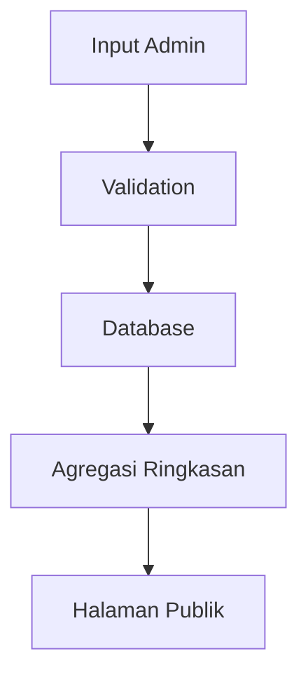

# Data Flow

## Tujuan
Dokumen ini menjelaskan perpindahan data antar aktor, aplikasi, database, dan output publik.

## Data Flow Berita

### Entitas Terkait
- `posts`
- `post_categories`
- `post_tags`
- `media`

### Validasi Inti
- Judul wajib.
- Slug unik.
- Status harus valid.
- Thumbnail dan media sesuai tipe file.

## Data Flow Surat

### Entitas Terkait
- `letter_types`
- `letter_requirements`
- `letter_requests`
- `letter_request_files`
- `letter_approvals`
- `generated_letters`

### Data Lifecycle
- Draft pengajuan dibuat warga.
- Dokumen dan metadata tersimpan di database dan storage.
- Setiap tahap approval menambah jejak histori.
- PDF final menjadi arsip resmi yang dapat diakses sesuai izin.

## Data Flow Pengaduan

## Data Flow APBDes

## Prinsip Desain Data
- Setiap perubahan status harus auditable.
- Lampiran dipisahkan dari tabel utama agar lifecycle file jelas.
- Status publik dan status internal dapat dibedakan jika dibutuhkan.
- Data publik hanya mengambil record berstatus publish atau approved.
