# ERD

## ERD V1 - Domain Utama

```mermaid
erDiagram
    USERS ||--o{ MODEL_HAS_ROLES : has
    ROLES ||--o{ MODEL_HAS_ROLES : assigned_to
    USERS ||--o{ MODEL_HAS_PERMISSIONS : has
    PERMISSIONS ||--o{ MODEL_HAS_PERMISSIONS : granted_to
    ROLES ||--o{ ROLE_HAS_PERMISSIONS : maps
    PERMISSIONS ||--o{ ROLE_HAS_PERMISSIONS : maps

    VILLAGES ||--|| VILLAGE_PROFILES : has
    VILLAGES ||--o{ VILLAGE_OFFICIALS : has

    POST_CATEGORIES ||--o{ POSTS : groups
    POSTS ||--o{ MEDIA : uses
    POSTS ||--o{ POST_TAG : tags
    POST_TAGS ||--o{ POST_TAG : tags

    POTENTIAL_CATEGORIES ||--o{ POTENTIALS : groups
    POTENTIALS ||--o{ POTENTIAL_GALLERIES : has

    BUDGET_YEARS ||--o{ BUDGETS : has
    BUDGET_CATEGORIES ||--o{ BUDGETS : groups
    BUDGETS ||--o{ BUDGET_REALIZATIONS : realized_by

    HAMLETS ||--o{ RWS : has
    RWS ||--o{ RTS : has
    HOUSEHOLDS ||--o{ CITIZENS : contains
    HAMLETS ||--o{ HOUSEHOLDS : contains
    RWS ||--o{ HOUSEHOLDS : contains
    RTS ||--o{ HOUSEHOLDS : contains

    LETTER_TYPES ||--o{ LETTER_REQUIREMENTS : defines
    LETTER_TYPES ||--o{ LETTER_REQUESTS : requested_as
    LETTER_REQUESTS ||--o{ LETTER_REQUEST_FILES : attaches
    LETTER_REQUESTS ||--o{ LETTER_APPROVALS : approved_through
    LETTER_REQUESTS ||--|| GENERATED_LETTERS : generates

    COMPLAINT_CATEGORIES ||--o{ COMPLAINTS : groups
    COMPLAINTS ||--o{ COMPLAINT_COMMENTS : has
    COMPLAINTS ||--o{ COMPLAINT_ATTACHMENTS : has

    BUSINESS_CATEGORIES ||--o{ BUSINESSES : groups
    BUSINESSES ||--o{ BUSINESS_PRODUCTS : sells

    BUMDES_UNITS ||--o{ BUMDES_TRANSACTIONS : records
```

## Daftar Entitas
### Authentication
- `users`
- `roles`
- `permissions`
- `model_has_roles`
- `model_has_permissions`
- `role_has_permissions`

### Desa
- `villages`
- `village_profiles`
- `village_officials`

### Konten
- `posts`
- `post_categories`
- `post_tags`
- `post_tag`
- `media`

### Potensi Desa
- `potentials`
- `potential_categories`
- `potential_galleries`

### APBDes
- `budget_years`
- `budget_categories`
- `budgets`
- `budget_realizations`

### Penduduk
- `households`
- `citizens`
- `hamlets`
- `rws`
- `rts`

### Surat
- `letter_types`
- `letter_requirements`
- `letter_requests`
- `letter_request_files`
- `letter_approvals`
- `generated_letters`

### Pengaduan
- `complaints`
- `complaint_categories`
- `complaint_comments`
- `complaint_attachments`

### UMKM
- `businesses`
- `business_categories`
- `business_products`

### BUMDes
- `bumdes_units`
- `bumdes_transactions`

## Catatan Desain
- `media` dapat dibuat polymorphic bila ingin dipakai lintas modul.
- `generated_letters` dipisahkan dari `letter_requests` untuk mengisolasi hasil final.
- `complaint_comments` perlu kolom visibilitas untuk catatan internal dan balasan publik.
