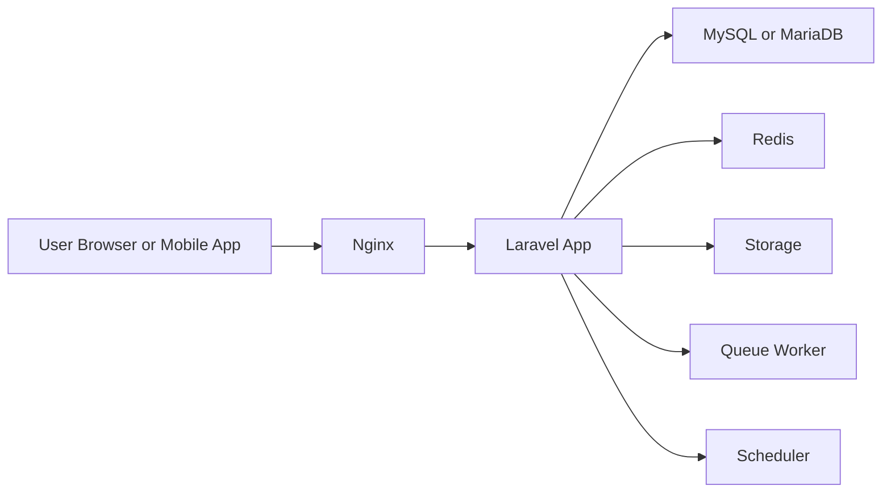

# Deployment Architecture

## Rekomendasi Arsitektur Laravel
Struktur berikut cocok untuk rebuild SatuDesa dan selaras dengan aplikasi Laravel modern berbasis Livewire.

```text
app/
├── Models
├── Livewire
│   ├── Admin
│   ├── Public
│   └── Citizen
├── Services
├── Actions
├── Policies
├── Enums
└── DTOs
```

## Target Arsitektur Aplikasi
### Layer Aplikasi
- `Models` untuk representasi data dan relasi Eloquent.
- `Livewire/Admin` untuk dashboard internal.
- `Livewire/Public` untuk halaman website publik.
- `Livewire/Citizen` untuk portal warga seperti surat dan pengaduan.
- `Services` untuk orkestrasi domain yang tidak cocok disimpan di model.
- `Actions` untuk use case terfokus seperti submit surat, approve surat, publish berita.
- `Policies` untuk otorisasi.
- `Enums` untuk status dan konstanta domain.
- `DTOs` untuk payload terstruktur antar layer.

## Infrastruktur Produksi yang Disarankan


## Komponen Infrastruktur
| Komponen | Fungsi |
| --- | --- |
| Nginx | Web server dan reverse proxy |
| PHP-FPM 8.3 | Runtime Laravel |
| MySQL atau MariaDB | Database utama |
| Redis | Cache, queue, session bila diperlukan |
| Storage lokal atau object storage | Media, lampiran, PDF |
| Queue worker | Email, notifikasi, generate dokumen |
| Scheduler | Tugas terjadwal |

## Environment yang Disarankan
### Development
- Laravel Sail atau local PHP stack
- Queue sync untuk awal, lalu Redis saat workflow bertambah

### Staging
- Mirror produksi
- Data uji terpisah
- Otomatisasi deploy dan smoke test

### Production
- HTTPS wajib
- Queue worker terpisah
- Backup database terjadwal
- Monitoring log dan error tracking

## Deployment Notes
- Gunakan `storage:link` dan pastikan folder upload persisten.
- Generate PDF dan upload file sebaiknya lewat queue bila beban meningkat.
- Pisahkan konfigurasi publik dan admin bila trafik tumbuh.

## Rebuild Alignment dengan Repo Saat Ini
Repo saat ini sudah memiliki fondasi Laravel, Fortify, Livewire, `Actions`, `Enums`, `Policies`, dan `Livewire`. Tahap berikutnya adalah menambahkan pemisahan area `Admin`, `Public`, dan `Citizen`, lalu mengisi domain model serta workflow per modul secara bertahap.
